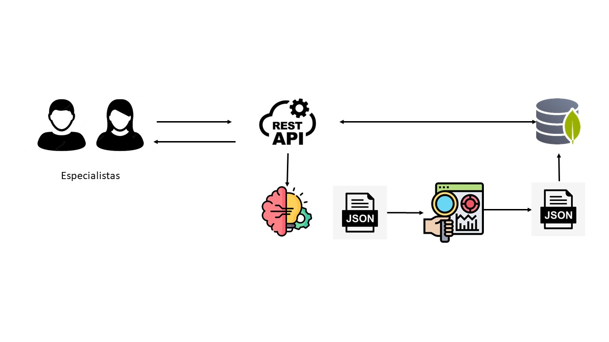

# Machine Learning Operations (MLOps)

El presente repositorio muestra una solución al problema planteado en el siguiente enlace: [Enlace a GitHub](https://github.com/soyHenry/PI_ML_OPS/tree/FT). En él se detalla que debemos asumir el rol de Data Engineer para obtener un MVP (Minimum Viable Product), realizando las siguientes actividades:
* Realizar un análisis exploratorio de datos.
* Crear una API Rest de acuerdo con los endpoints requeridos.
* Seleccionar un modelo de predicción basado en nuestros datos.
* Desarrollar una NLP según las indicaciones del repositorio de GitHub.

# Descripción
Para cualquier proceso que involucre datos, debemos comenzar primero con una exploración de los datos para poder obtener información sobre las variables, las relaciones entre ellas, la calidad de los datos, etc.

Para este proyecto, los datos se encuentran en el siguiente enlace:
[Datos en Google Drive](https://drive.google.com/drive/folders/1HqBG2-sUkz_R3h1dZU5F2uAzpRn7BSpj)

## Análisis Exploratorio

Para esta etapa utilizaremos Google Colab para realizar las transformaciones, completar y exportar los datos. En el siguiente enlace https://drive.google.com/drive/folders/1O0db6IIFGkzCB18xvikUeVXUrTFAFhXQ?usp=drive_link, esta el archivo donde detallo el paso a paso de las transformaciones realizadas en los datos para nuestro casos casos requeridos. Por cada endpoint tenemos un archivo:
- UserForGenre.ipynb
- Recomendacion.ipynb
. Sentiment_analysis.ipynb
- UserRecommend.ipynb
- PlayTimeGenre.ipynb

Tener en cuenta que de cada archivo *.ipynb obtenemos sus respectivos json para luego cargarlo en nuestra base de datos.

## Base de Datos 

Para trabajar de una manera eficiente a la hora de realizar las consultas, opte por la opción de utilizar una base de datos no relacional. 
En este proyecto no ayudaremos de la herramienta de MongoAtlas, es aquí donde subiremos nuestros archivos json.
Nuestra base de datos, tendrá la siguiente estructura:
1. Nombre de Base de datos: ProyectosoyHenry
2. Nombre de nuestra Colección: Cada nombre del archivo json será el de la colección.
3. El archivo json tiene los documentos para cada colección.

## API Rest

El desarrollo de esta servicio esta desarrollo en el framework FLASK. A su vez, esta API tendra los siguientes endpoints, los cuales todos son metodos GET.
* def PlayTimeGenre( genero : str ): Debe devolver año con mas horas jugadas para dicho género.
Ejemplo de retorno: {"Año de lanzamiento con más horas jugadas para Género X" : 2013}

* def UserForGenre( genero : str ): Debe devolver el usuario que acumula más horas jugadas para el género dado y una lista de la acumulación de horas jugadas por año.
Ejemplo de retorno: {"Usuario con más horas jugadas para Género X" : us213ndjss09sdf, "Horas jugadas":[{Año: 2013, Horas: 203}, {Año: 2012, Horas: 100}, {Año: 2011, Horas: 23}]}

* def UsersRecommend( año : int ): Devuelve el top 3 de juegos MÁS recomendados por usuarios para el año dado. (reviews.recommend = True y comentarios positivos/neutrales)
Ejemplo de retorno: [{"Puesto 1" : X}, {"Puesto 2" : Y},{"Puesto 3" : Z}]

* def UsersNotRecommend( año : int ): Devuelve el top 3 de juegos MENOS recomendados por usuarios para el año dado. (reviews.recommend = False y comentarios negativos)
Ejemplo de retorno: [{"Puesto 1" : X}, {"Puesto 2" : Y},{"Puesto 3" : Z}]

* def sentiment_analysis( año : int ): Según el año de lanzamiento, se devuelve una lista con la cantidad de registros de reseñas de usuarios que se encuentren categorizados con un análisis de sentimiento.

Un sistema de recomendación user-item:

* def recomendacion_usuario( id de usuario ): Ingresando el id de un usuario, deberíamos recibir una lista con 5 juegos recomendados para dicho usuario.

## Machine Learning

Para este sección seleccionamos la ténica de Collaborative Filtering, teniendo como antecedente la documentación https://www.aprendemachinelearning.com/sistemas-de-recomendacion/ .
Posteriormente a la elección del algoritmo, debemos exponerlo en API con los siguientes endpoints:

* def recomendacion_usuario( id de usuario ): Ingresando el id de un usuario, deberíamos recibir una lista con 5 juegos recomendados para dicho usuario.

# Habilidades Desarrolladas
En este proyecto, he aplicado y desarrollado las siguientes habilidades y tecnologías:
* Desarrollo de __API REST__ con el framework __FLASK__.
* Programación orientada a objetos - __Python__.
* Aplicación del patron de diseño __MVC__ (modelo vista controlador).
* Utilización de herramientas de control de versiones como __Git__.
* Aplicación de __Base de datos No Relacionales__ - __MongoDB__.
* Despliegue del servicio en __Render__.

# Desafios

Durante el desarrollo de este proyecto, nos enfrentamos a varios desafíos, pero uno de los más destacados fue la gestión de grandes volúmenes de datos al desplegar la API REST en un servicio gratuito.

Es importante tener en cuenta que este proyecto se centra en la creación de un Producto Mínimo Viable (MVP, por sus siglas en inglés), lo que nos permitió trabajar con datos parciales. En lugar de cargar estos archivos JSON en el repositorio, optamos por configurar la base de datos para evitar sobrecargar el servicio de implementación.

Esta estrategia nos permitió mantener un rendimiento óptimo en nuestro servicio en línea mientras desarrollábamos el MVP, al mismo tiempo que nos preparaba para futuras expansiones y escalabilidad.